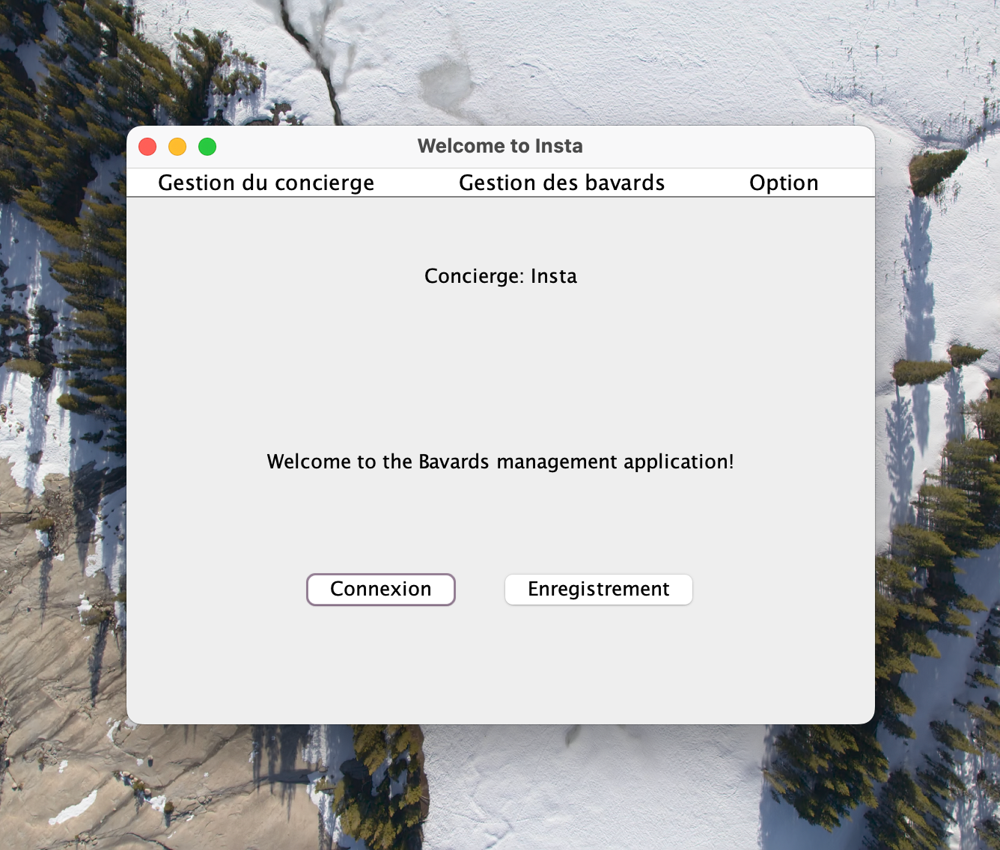

# Introduction

Cette messagerie Java est une application de chat sophistiquée capable de gérer la connexion de plusieurs utilisateurs avec mot de passe, la gestion des utilisateurs en ligne, ainsi que la diffusion et la réception de messages. Les fonctionnalités incluent l'inscription, la connexion, l'envoi de messages, l'abonnement aux messages des autres utilisateurs, la consultation des messages disponibles dans un pop-up, et la visualisation des utilisateurs en ligne. Voici un aperçu détaillé de chaque fonctionnalité implémentée.

# Fonctionnement

Clonez le repo git et lancer le fichier `MainGUI.java` c'est ensuite que la magie opère !

# Fonctionnalités

### Inscription
L'inscription permet aux nouveaux utilisateurs de créer un compte. Les utilisateurs doivent fournir un nom d'utilisateur unique et un mot de passe ainsi que sa confirmation pour s'inscrire.

![[img-readme-rapport/Inscription.png]]
### Connexion
La fonctionnalité de connexion permet aux utilisateurs inscrits d'accéder à leur compte. Ils doivent entrer leur nom d'utilisateur et leur mot de passe pour se connecter.

![[img-readme-rapport/Login.png]]
### Envoi de Message
Les utilisateurs peuvent envoyer des messages à d'autres utilisateurs connectés. Cette fonctionnalité inclut la possibilité de mettre un objet et un corps dans le message.

![[img-readme-rapport/Connecté.png]]
### Abonnement aux Messages des Autres
Les utilisateurs peuvent s'abonner aux messages d'autres utilisateurs. Cela signifie qu'ils recevront et pourront lire les messages de tout les  utilisateurs.

![[img-readme-rapport/Connexion_concierge.png]]
### Consultation des Messages
Les utilisateurs peuvent consulter tous les messages disponibles dans un pop-up. Cette fonctionnalité offre une vue claire et organisée des messages reçus et envoyés, permettant aux utilisateurs de suivre facilement leurs conversations.

![[img-readme-rapport/Messages_envoyés_recu.png]]
![[img-readme-rapport/messages_pop-up.png]]
### Visualisation des Utilisateurs en Ligne
Cette fonctionnalité permet aux utilisateurs de voir qui est en ligne. Une liste des utilisateurs actuellement connectés est affichée sur la partie gauche de la fenêtre, une fois que l'utilisateur est connecté.

![[img-readme-rapport/Utilisateurs_connectes.png]]
# Conclusion et À Venir

### Fonctionnalités à Venir

- **Gestion des Utilisateurs par l'Administrateur :** 
	Les administrateurs auront des outils supplémentaires pour gérer les utilisateurs, y compris la possibilité de supprimer des comptes, en ajouter ou encore de réinitialiser des mots de passe.

- **Gestion des Bavardages par l'Administrateur :** 
	Une fonctionnalité de gestion des bavardages permettra de suivre et de modérer les discussions globales. Elle permettra principalement de supprimer des messages qui posent soucis, et à terme, de consulter les messages privés entre les utilisateurs.
